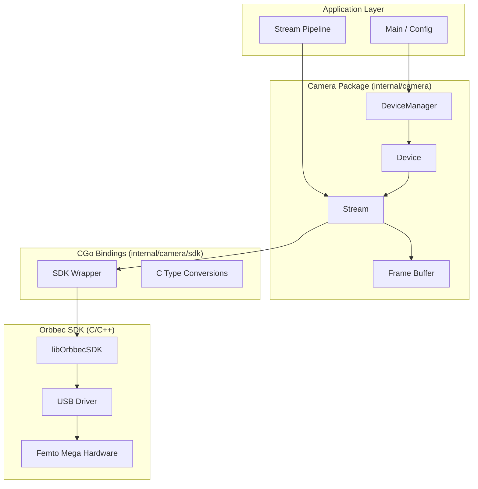
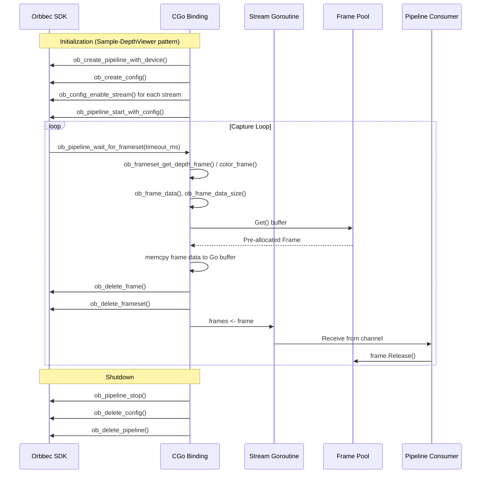
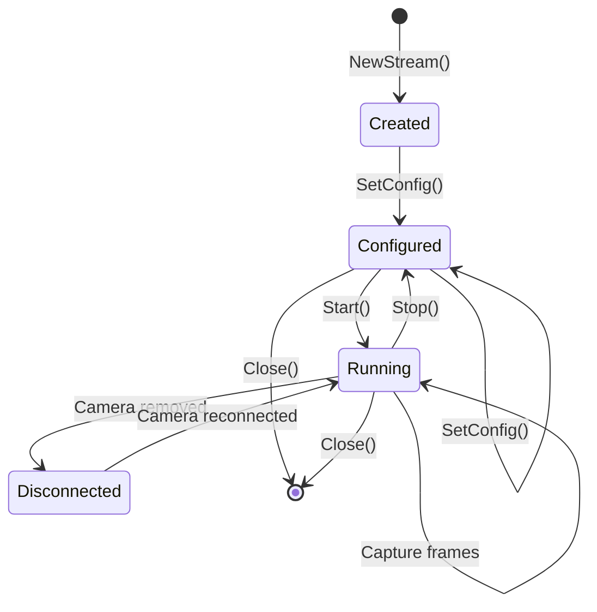

# Orbbec Camera Integration Design Document

## Overview

This design document describes the technical architecture for integrating the Orbbec Femto Mega depth camera into the Go-based network streaming application. The integration provides a clean Go API for device discovery, stream configuration, and frame capture, abstracting the underlying C/C++ Orbbec SDK through CGo bindings.

The camera integration serves as the data source for the UDP streaming pipeline, delivering frames through Go channels for efficient, concurrent processing.

## SDK Reference

**SDK Version**: Orbbec SDK v1.10.27
**Location**: `orbbec-sdk/OrbbecSDK_v1.10.27/`

### SDK Structure
```
orbbec-sdk/OrbbecSDK_v1.10.27/
├── SDK/
│   ├── include/libobsensor/      # C/C++ headers
│   │   ├── h/                    # C API (our target)
│   │   │   ├── ObSensor.h        # Main entry point (includes all)
│   │   │   ├── Context.h         # SDK context management
│   │   │   ├── Device.h          # Device enumeration/control
│   │   │   ├── Sensor.h          # Low-level sensor API
│   │   │   ├── Pipeline.h        # High-level streaming API
│   │   │   ├── Frame.h           # Frame data handling
│   │   │   ├── StreamProfile.h   # Stream configuration
│   │   │   ├── Filter.h          # Post-processing filters
│   │   │   ├── Property.h        # Device properties (70+)
│   │   │   ├── Error.h           # Error handling
│   │   │   └── ObTypes.h         # All type definitions
│   │   └── hpp/                  # C++ wrappers (not used)
│   ├── lib/                      # Windows x64 binaries
│   │   ├── OrbbecSDK.dll         # Main SDK (9.4 MB)
│   │   ├── OrbbecSDK.lib         # Import library
│   │   ├── live555.dll           # Streaming support
│   │   ├── ob_usb.dll            # USB communication
│   │   └── depthengine_2_0.dll   # Depth processing
│   └── config/                   # SDK configuration
├── Example/
│   ├── c/                        # 14 C examples (reference)
│   └── cpp/                      # 22 C++ examples
└── Doc/                          # API documentation
```

### Key C Examples for Reference
| Example | Purpose | Key APIs Demonstrated |
|---------|---------|----------------------|
| **Sample-HelloOrbbec** | Device enumeration | `ob_create_context`, `ob_query_device_list` |
| **Sample-DepthViewer** | Depth streaming | `ob_create_pipeline`, `ob_pipeline_start`, `ob_pipeline_wait_for_frameset` |
| **Sample-ColorViewer** | Color streaming | Same as above with color config |
| **Sample-InfraredViewer** | IR streaming | IR stream profile configuration |
| **Sample-HotPlugin** | Device plug/unplug | `ob_set_device_changed_callback` |
| **Sample-SensorControl** | Low-level sensor API | `ob_device_get_sensor`, `ob_sensor_start` |
| **Sample-ImuReader** | IMU data | Accelerometer/gyroscope streams |
| **Sample-Post-Processing** | Filters | `ob_create_filter`, filter chain |

### SDK API Levels
The SDK provides two API approaches:

1. **Pipeline API** (High-level) - Recommended for most use cases
   - Synchronizes multiple streams automatically
   - Returns `ob_frameset` with aligned frames
   - Handles stream configuration through `ob_config`

2. **Sensor API** (Low-level) - Direct sensor control
   - Individual sensor start/stop
   - Frame callbacks per sensor
   - More control, more complexity

## Architecture

### High-Level Architecture



### Package Structure

```
internal/
├── camera/
│   ├── camera.go          # Public API, DeviceManager
│   ├── device.go          # Device type and methods
│   ├── stream.go          # Stream type and capture loop
│   ├── frame.go           # Frame type and buffer pool
│   ├── config.go          # Configuration types
│   ├── errors.go          # Error types and wrapping
│   └── sdk/
│       ├── sdk.go         # CGo bindings entry point
│       ├── sdk.h          # C header declarations
│       ├── types.go       # C <-> Go type conversions
│       ├── context.go     # SDK context management
│       ├── device.go      # Device-related bindings
│       └── stream.go      # Stream-related bindings
```

### Technology Stack

**Go Application**
- Go 1.21+ with CGo enabled
- Channel-based concurrency for frame delivery
- `sync` package for thread-safe operations
- `context` package for cancellation

**CGo Bindings**
- Direct bindings to Orbbec SDK C API
- Minimal C code in Go files (prefer pure CGo declarations)
- Explicit memory management with `C.free()` calls

**External Dependencies**
- Orbbec SDK v1.10.27 (included in `orbbec-sdk/OrbbecSDK_v1.10.27/`)
  - `OrbbecSDK.dll` / `libOrbbecSDK.so` - Main SDK
  - `live555.dll` - Streaming support (network cameras)
  - `ob_usb.dll` - USB communication
  - `depthengine_2_0.dll` - Depth processing
- Platform USB stack (libudev on Linux, Windows USB drivers)

## Components and Interfaces

### Core Types

#### StreamType Enumeration
```go
// StreamType identifies the type of data stream
type StreamType uint8

const (
    StreamTypeDepth StreamType = iota
    StreamTypeColor
    StreamTypeIR
    StreamTypeIMU
)

func (s StreamType) String() string
```

#### PixelFormat Enumeration
```go
// PixelFormat identifies the pixel data format
type PixelFormat uint8

const (
    PixelFormatDepthU16   PixelFormat = iota // uint16, millimeters
    PixelFormatDepthF32                       // float32, meters
    PixelFormatRGB8                           // 3 bytes per pixel
    PixelFormatRGBA8                          // 4 bytes per pixel
    PixelFormatMJPEG                          // Compressed JPEG
    PixelFormatYUV422                         // YUV 4:2:2
    PixelFormatIR16                           // uint16 intensity
    PixelFormatIMU                            // 6DoF struct
)

func (p PixelFormat) BytesPerPixel() int
func (p PixelFormat) String() string
```

### Frame Type

```go
// Frame represents a single captured frame from a stream
type Frame struct {
    StreamType  StreamType
    FrameID     uint64      // Monotonically increasing
    Timestamp   int64       // Nanoseconds since epoch
    Width       uint16
    Height      uint16
    Format      PixelFormat
    Data        []byte      // Raw pixel data (owned by pool)
    pool        *framePool  // Return destination
}

// Size returns the frame data size in bytes
func (f *Frame) Size() int

// Release returns the frame buffer to the pool
func (f *Frame) Release()

// Clone creates a copy with independently owned data
func (f *Frame) Clone() *Frame
```

### Frame Pool (Memory Management)

```go
// framePool manages pre-allocated frame buffers to reduce GC pressure
type framePool struct {
    buffers chan *Frame
    size    int  // Buffer capacity in bytes
}

func newFramePool(count, bufferSize int) *framePool
func (p *framePool) Get() *Frame
func (p *framePool) Put(f *Frame)
```

### StreamConfig Type

```go
// StreamConfig defines the configuration for a single stream
type StreamConfig struct {
    Type       StreamType
    Enabled    bool
    Width      uint16
    Height     uint16
    FPS        uint8
    Format     PixelFormat
}

// Validate checks if the configuration is valid for this stream type
func (c *StreamConfig) Validate() error

// DefaultDepthConfig returns sensible defaults for depth stream
func DefaultDepthConfig() StreamConfig

// DefaultColorConfig returns sensible defaults for color stream
func DefaultColorConfig() StreamConfig
```

### Stream Interface

```go
// Stream captures frames from a single sensor
type Stream struct {
    config    StreamConfig
    device    *Device
    frames    chan *Frame     // Output channel
    pool      *framePool
    running   atomic.Bool
    ctx       context.Context
    cancel    context.CancelFunc
    sdkStream *sdk.Stream     // CGo handle
}

// Frames returns the channel for receiving captured frames
func (s *Stream) Frames() <-chan *Frame

// Config returns the current stream configuration
func (s *Stream) Config() StreamConfig

// SetConfig updates the stream configuration (may restart stream)
func (s *Stream) SetConfig(cfg StreamConfig) error

// Start begins frame capture
func (s *Stream) Start() error

// Stop halts frame capture
func (s *Stream) Stop() error

// IsRunning returns true if actively capturing
func (s *Stream) IsRunning() bool
```

### Device Interface

```go
// DeviceInfo contains metadata about a connected camera
type DeviceInfo struct {
    SerialNumber string
    Name         string
    FirmwareVer  string
    USBType      string  // "USB2.0" or "USB3.0"
}

// Device represents a connected Orbbec camera
type Device struct {
    info       DeviceInfo
    streams    map[StreamType]*Stream
    connected  atomic.Bool
    mu         sync.RWMutex
    sdkDevice  *sdk.Device   // CGo handle

    // Event callbacks
    onDisconnect func()
}

// Info returns device metadata
func (d *Device) Info() DeviceInfo

// Stream returns the stream for the given type
func (d *Device) Stream(t StreamType) *Stream

// IsConnected returns current connection status
func (d *Device) IsConnected() bool

// Close releases all resources and disconnects
func (d *Device) Close() error

// OnDisconnect sets callback for disconnect events
func (d *Device) OnDisconnect(fn func())
```

### DeviceManager Interface

```go
// DeviceManager handles device discovery and lifecycle
type DeviceManager struct {
    devices   map[string]*Device  // by serial number
    mu        sync.RWMutex
    ctx       context.Context
    sdkCtx    *sdk.Context        // CGo handle
}

// NewDeviceManager creates a new manager and initializes the SDK
func NewDeviceManager(ctx context.Context) (*DeviceManager, error)

// Discover enumerates connected Orbbec devices
func (m *DeviceManager) Discover() ([]DeviceInfo, error)

// Open connects to a device by serial number (empty = first available)
func (m *DeviceManager) Open(serial string) (*Device, error)

// Close releases all devices and SDK resources
func (m *DeviceManager) Close() error
```

## CGo Bindings Design

### SDK Wrapper Structure

```go
// internal/camera/sdk/sdk.go

/*
#cgo CFLAGS: -I${SRCDIR}/../../../orbbec-sdk/OrbbecSDK_v1.10.27/SDK/include
#cgo windows LDFLAGS: -L${SRCDIR}/../../../orbbec-sdk/OrbbecSDK_v1.10.27/SDK/lib -lOrbbecSDK
#cgo linux LDFLAGS: -L${SRCDIR}/../../../orbbec-sdk/OrbbecSDK_v1.10.27/SDK/lib -lOrbbecSDK -Wl,-rpath,$ORIGIN/../lib

#include <libobsensor/ObSensor.h>
#include <stdlib.h>
#include <string.h>
*/
import "C"

// Context wraps ob_context (from Context.h)
type Context struct {
    ptr *C.ob_context
}

// DeviceList wraps ob_device_list (from Device.h)
type DeviceList struct {
    ptr *C.ob_device_list
}

// Device wraps ob_device (from Device.h)
type Device struct {
    ptr *C.ob_device
}

// Pipeline wraps ob_pipeline - the high-level streaming API (from Pipeline.h)
type Pipeline struct {
    ptr    *C.ob_pipeline
    config *C.ob_config
}

// FrameSet wraps ob_frameset - synchronized multi-stream frames (from Frame.h)
type FrameSet struct {
    ptr *C.ob_frameset
}

// Frame wraps ob_frame - single frame data (from Frame.h)
type Frame struct {
    ptr *C.ob_frame
}

// StreamProfile wraps ob_stream_profile (from StreamProfile.h)
type StreamProfile struct {
    ptr *C.ob_stream_profile
}
```

### SDK Type Mappings

From `ObTypes.h`, the key enumerations we'll map:

```go
// SensorType maps to ob_sensor_type
type SensorType int
const (
    SensorUnknown SensorType = C.OB_SENSOR_UNKNOWN
    SensorIR      SensorType = C.OB_SENSOR_IR
    SensorColor   SensorType = C.OB_SENSOR_COLOR
    SensorDepth   SensorType = C.OB_SENSOR_DEPTH
    SensorAccel   SensorType = C.OB_SENSOR_ACCEL
    SensorGyro    SensorType = C.OB_SENSOR_GYRO
)

// FrameFormat maps to ob_format (35+ formats in SDK)
type FrameFormat int
const (
    FormatYUYV    FrameFormat = C.OB_FORMAT_YUYV
    FormatNV12    FrameFormat = C.OB_FORMAT_NV12
    FormatMJPG    FrameFormat = C.OB_FORMAT_MJPG
    FormatRGB     FrameFormat = C.OB_FORMAT_RGB
    FormatBGR     FrameFormat = C.OB_FORMAT_BGR
    FormatRGBA    FrameFormat = C.OB_FORMAT_RGBA
    FormatY16     FrameFormat = C.OB_FORMAT_Y16     // Depth uint16
    FormatY8      FrameFormat = C.OB_FORMAT_Y8
    FormatACCEL   FrameFormat = C.OB_FORMAT_ACCEL
    FormatGYRO    FrameFormat = C.OB_FORMAT_GYRO
)

// ExceptionType maps to ob_exception_type (for error classification)
type ExceptionType int
const (
    ExceptionUnknown          ExceptionType = C.OB_EXCEPTION_TYPE_UNKNOWN
    ExceptionCameraDisconnect ExceptionType = C.OB_EXCEPTION_TYPE_CAMERA_DISCONNECTED
    ExceptionPlatform         ExceptionType = C.OB_EXCEPTION_TYPE_PLATFORM
    ExceptionInvalidValue     ExceptionType = C.OB_EXCEPTION_TYPE_INVALID_VALUE
    ExceptionWrongSequence    ExceptionType = C.OB_EXCEPTION_TYPE_WRONG_API_CALL_SEQUENCE
    ExceptionNotImplemented   ExceptionType = C.OB_EXCEPTION_TYPE_NOT_IMPLEMENTED
    ExceptionIO               ExceptionType = C.OB_EXCEPTION_TYPE_IO
    ExceptionMemory           ExceptionType = C.OB_EXCEPTION_TYPE_MEMORY
)
```

### Memory Safety Pattern

```go
// All C allocations tracked and freed explicitly
func (c *Context) Close() error {
    if c.ptr != nil {
        C.ob_delete_context(c.ptr)
        c.ptr = nil
    }
    return nil
}

// Frame data copied to Go-managed buffer immediately
func copyFrameData(cFrame *C.ob_frame, goBuffer []byte) {
    data := C.ob_frame_data(cFrame)
    size := C.ob_frame_data_size(cFrame)
    C.memcpy(unsafe.Pointer(&goBuffer[0]), data, size)
    // cFrame released by SDK, goBuffer owned by Go
}
```

### Error Handling in CGo

The SDK uses a consistent error pattern (from `Error.h`):
- All functions take `ob_error **error` as last parameter
- On error, allocates `ob_error` struct with details
- Caller must check and delete error with `ob_delete_error()`

```go
// SDK errors converted to Go errors immediately
// Uses: ob_error_status, ob_error_message, ob_error_exception_type, ob_delete_error
func checkError(err *C.ob_error) error {
    if err != nil {
        msg := C.GoString(C.ob_error_message(err))
        status := int(C.ob_error_status(err))
        exType := ExceptionType(C.ob_error_exception_type(err))
        fn := C.GoString(C.ob_error_function(err))
        C.ob_delete_error(err)
        return &SDKError{
            Status:        status,
            Message:       msg,
            ExceptionType: exType,
            Function:      fn,
        }
    }
    return nil
}

// Every SDK call follows this pattern (matching C examples)
func (c *Context) QueryDeviceList() (*DeviceList, error) {
    var err *C.ob_error
    list := C.ob_query_device_list(c.ptr, &err)
    if e := checkError(err); e != nil {
        return nil, e
    }
    return &DeviceList{ptr: list}, nil
}

// Example from Sample-HelloOrbbec pattern
func (d *Device) GetSerialNumber() (string, error) {
    var err *C.ob_error
    serial := C.ob_device_get_serial_number(d.ptr, &err)
    if e := checkError(err); e != nil {
        return "", e
    }
    return C.GoString(serial), nil
}

// Pipeline API example (from Sample-DepthViewer pattern)
func (p *Pipeline) WaitForFrameSet(timeoutMs int) (*FrameSet, error) {
    var err *C.ob_error
    fs := C.ob_pipeline_wait_for_frameset(p.ptr, C.uint32_t(timeoutMs), &err)
    if e := checkError(err); e != nil {
        return nil, e
    }
    if fs == nil {
        return nil, nil // Timeout, no frame
    }
    return &FrameSet{ptr: fs}, nil
}
```

## Data Flow

### Frame Capture Pipeline

Based on SDK's Pipeline API (from `Pipeline.h` and `Frame.h`):



### Key SDK Functions Used (from Frame.h)
```go
// Frame metadata extraction
func (f *Frame) GetIndex() uint64      // ob_frame_index()
func (f *Frame) GetFormat() FrameFormat // ob_frame_format()
func (f *Frame) GetTimestamp() uint64   // ob_frame_time_stamp() - device timestamp
func (f *Frame) GetSystemTimestamp() uint64 // ob_frame_system_time_stamp()
func (f *Frame) GetWidth() int         // ob_video_frame_width()
func (f *Frame) GetHeight() int        // ob_video_frame_height()
func (f *Frame) GetData() unsafe.Pointer // ob_frame_data()
func (f *Frame) GetDataSize() int      // ob_frame_data_size()
```

### Stream Lifecycle



### Device Hot-Plug Handling

Based on `Sample-HotPlugin` example, using `ob_set_device_changed_callback()` from `Context.h`:

```go
// Device change callback (called from SDK thread)
//export goDeviceChangedCallback
func goDeviceChangedCallback(removed, added *C.ob_device_list, userData unsafe.Pointer) {
    mgr := (*DeviceManager)(userData)

    // Handle removed devices
    if removed != nil {
        count := int(C.ob_device_list_device_count(removed, nil))
        for i := 0; i < count; i++ {
            serial := C.GoString(C.ob_device_list_get_device_serial_number(removed, C.uint32_t(i), nil))
            mgr.handleDeviceRemoved(serial)
        }
    }

    // Handle added devices
    if added != nil {
        count := int(C.ob_device_list_device_count(added, nil))
        for i := 0; i < count; i++ {
            serial := C.GoString(C.ob_device_list_get_device_serial_number(added, C.uint32_t(i), nil))
            mgr.handleDeviceAdded(serial)
        }
    }
}

// Register callback during context creation
func (c *Context) SetDeviceChangedCallback(mgr *DeviceManager) error {
    var err *C.ob_error
    C.ob_set_device_changed_callback(
        c.ptr,
        (*[0]byte)(C.goDeviceChangedCallback),
        unsafe.Pointer(mgr),
        &err,
    )
    return checkError(err)
}
```

## Error Handling

### Error Categories

Based on SDK's `ob_exception_type` enum from `ObTypes.h`:

```go
// errors.go

// SDKError represents an error from the Orbbec SDK
// Maps to ob_error structure (Error.h)
type SDKError struct {
    Status        int           // ob_error_status()
    Message       string        // ob_error_message()
    ExceptionType ExceptionType // ob_error_exception_type()
    Function      string        // ob_error_function() - which SDK call failed
}

func (e *SDKError) Error() string {
    return fmt.Sprintf("OrbbecSDK error in %s: %s (status=%d, type=%s)",
        e.Function, e.Message, e.Status, e.ExceptionType)
}

// IsCameraDisconnected checks if error indicates camera was unplugged
func (e *SDKError) IsCameraDisconnected() bool {
    return e.ExceptionType == ExceptionCameraDisconnect
}

// DeviceError represents device-level errors
type DeviceError struct {
    Serial  string
    Op      string  // "connect", "configure", "capture"
    Err     error
}

func (e *DeviceError) Error() string
func (e *DeviceError) Unwrap() error

// ConfigError represents invalid configuration
type ConfigError struct {
    Stream  StreamType
    Field   string
    Value   interface{}
    Reason  string
}

func (e *ConfigError) Error() string
```

### Error Handling Strategy

| Error Type | SDK Exception Type | Detection | Response |
|------------|-------------------|-----------|----------|
| SDK initialization failure | `OB_EXCEPTION_TYPE_PLATFORM` | `ob_create_context()` returns error | Fatal, exit application |
| No camera found | N/A | `ob_device_list_device_count()` = 0 | Log warning, retry via callback |
| Camera disconnect | `OB_EXCEPTION_TYPE_CAMERA_DISCONNECTED` | Hot-plug callback or capture error | Emit event, wait for reconnect callback |
| Invalid config | `OB_EXCEPTION_TYPE_INVALID_VALUE` | SDK rejects stream profile | Return error, keep current config |
| Frame capture timeout | N/A | `ob_pipeline_wait_for_frameset()` returns NULL | Log debug, continue capture loop |
| Wrong API sequence | `OB_EXCEPTION_TYPE_WRONG_API_CALL_SEQUENCE` | SDK state machine violation | Log error, recover state |
| USB bandwidth error | `OB_EXCEPTION_TYPE_IO` | Stream start fails | Reduce resolution/FPS, retry |
| Memory allocation | `OB_EXCEPTION_TYPE_MEMORY` | Any SDK call | Fatal or graceful degrade |

## Testing Strategy

### Unit Tests (60%)

```go
// camera_test.go

func TestStreamConfig_Validate(t *testing.T) {
    tests := []struct {
        name    string
        config  StreamConfig
        wantErr bool
    }{
        {"valid depth", StreamConfig{Type: StreamTypeDepth, Width: 640, Height: 576, FPS: 30}, false},
        {"invalid depth resolution", StreamConfig{Type: StreamTypeDepth, Width: 999, Height: 576, FPS: 30}, true},
        {"invalid FPS", StreamConfig{Type: StreamTypeDepth, Width: 640, Height: 576, FPS: 120}, true},
    }
    for _, tt := range tests {
        t.Run(tt.name, func(t *testing.T) {
            err := tt.config.Validate()
            if (err != nil) != tt.wantErr {
                t.Errorf("Validate() error = %v, wantErr %v", err, tt.wantErr)
            }
        })
    }
}

func TestFramePool(t *testing.T) {
    pool := newFramePool(3, 1024*1024)

    // Get all frames
    frames := make([]*Frame, 3)
    for i := range frames {
        frames[i] = pool.Get()
    }

    // Return one
    frames[0].Release()

    // Should be able to get another
    f := pool.Get()
    if f == nil {
        t.Error("Expected to get frame after release")
    }
}
```

### Mock SDK for Unit Testing

```go
// sdk/mock.go (build tag: !cgo)

// MockContext provides a test double for SDK Context
type MockContext struct {
    Devices []MockDeviceInfo
}

// MockDevice provides a test double for SDK Device
type MockDevice struct {
    Info          MockDeviceInfo
    FrameSequence [][]byte  // Pre-recorded frames to replay
    frameIndex    int
}
```

### Integration Tests (30%)

```go
// integration_test.go (build tag: integration)

func TestDeviceManager_RealHardware(t *testing.T) {
    if testing.Short() {
        t.Skip("Skipping hardware test in short mode")
    }

    ctx := context.Background()
    mgr, err := NewDeviceManager(ctx)
    if err != nil {
        t.Fatalf("Failed to create manager: %v", err)
    }
    defer mgr.Close()

    devices, err := mgr.Discover()
    if err != nil {
        t.Fatalf("Discovery failed: %v", err)
    }

    if len(devices) == 0 {
        t.Skip("No cameras connected")
    }

    t.Logf("Found %d device(s)", len(devices))
}
```

### Benchmark Tests (10%)

```go
// bench_test.go

func BenchmarkFrameCapture(b *testing.B) {
    // Setup: connect to camera, configure stream
    stream := setupTestStream(b, StreamTypeDepth, 640, 576, 30)
    defer stream.Stop()

    b.ResetTimer()
    for i := 0; i < b.N; i++ {
        select {
        case frame := <-stream.Frames():
            frame.Release()
        case <-time.After(100 * time.Millisecond):
            b.Fatal("Frame timeout")
        }
    }
}

func BenchmarkFramePool(b *testing.B) {
    pool := newFramePool(10, 2*1024*1024)

    b.RunParallel(func(pb *testing.PB) {
        for pb.Next() {
            f := pool.Get()
            f.Release()
        }
    })
}
```

## Performance Considerations

### Memory Management
- **Frame Pool**: Pre-allocate N frame buffers (default: 10 per stream)
- **Buffer Sizing**: Calculate max buffer size per stream type (depth 640x576x2 = 737KB, color 4K RGB = 24MB)
- **Zero-Copy Where Possible**: Channel passes pointers, not data

### Concurrency
- **One Goroutine Per Stream**: Dedicated capture loop
- **Buffered Channels**: Frame channel buffer of 3-5 frames absorbs jitter
- **Lock-Free Stats**: Use `atomic` for counters

### Latency Optimization
- **Immediate Copy**: Copy frame data from C to Go immediately, release C frame
- **Non-Blocking Send**: If frame channel full, drop oldest frame (log warning)
- **Context Cancellation**: Fast shutdown via context

### Resource Budgets

| Resource | Target | Measurement |
|----------|--------|-------------|
| Memory per depth stream | < 10 MB | Pool + channel buffer |
| Memory per color stream (4K) | < 300 MB | Pool + channel buffer |
| CPU per stream @ 30 FPS | < 15% | Copy + channel ops |
| Frame latency (capture to channel) | < 10 ms | Timestamp diff |

## Platform-Specific Considerations

### Linux
- Requires udev rules for USB permissions
- `LD_LIBRARY_PATH` or rpath for SDK library
- Tested on Ubuntu 22.04+

```bash
# /etc/udev/rules.d/99-orbbec.rules
SUBSYSTEM=="usb", ATTR{idVendor}=="2bc5", MODE="0666"
```

### Windows
- SDK DLL must be in PATH or alongside executable
- May require Windows SDK for USB
- Visual Studio Build Tools for CGo

### Cross-Compilation
- Not supported (CGo requires target SDK)
- Build on target platform

## Configuration File Format

```yaml
# config.yaml
camera:
  serial: ""  # Empty = first available
  reconnect_interval: 5s

streams:
  depth:
    enabled: true
    width: 640
    height: 576
    fps: 30
    format: "uint16"

  color:
    enabled: true
    width: 1920
    height: 1080
    fps: 30
    format: "mjpeg"

  ir:
    enabled: false

  imu:
    enabled: false

pool:
  frames_per_stream: 10
```

---

**Requirements Traceability**: This design addresses all requirements from Section 3 (Acceptance Criteria) of requirements.md, specifically:
- Device Connection Requirements (DeviceManager, Device types)
- Stream Capture Requirements (Stream type, capture loop)
- Stream Configuration Requirements (StreamConfig, SetConfig)
- Frame Data Requirements (Frame type)
- Error Handling Requirements (Error types, reconnection logic)

**Review Status**: Draft

**Last Updated**: 2025-01-15

**Version**: 0.2

**SDK Reference**: Orbbec SDK v1.10.27 (`orbbec-sdk/OrbbecSDK_v1.10.27/`)

**Key SDK Examples Referenced**:
- `Example/c/Sample-HelloOrbbec` - Device enumeration pattern
- `Example/c/Sample-DepthViewer` - Pipeline streaming pattern
- `Example/c/Sample-HotPlugin` - Device hot-plug handling
- `Example/c/Sample-SensorControl` - Low-level sensor API (alternative approach)
